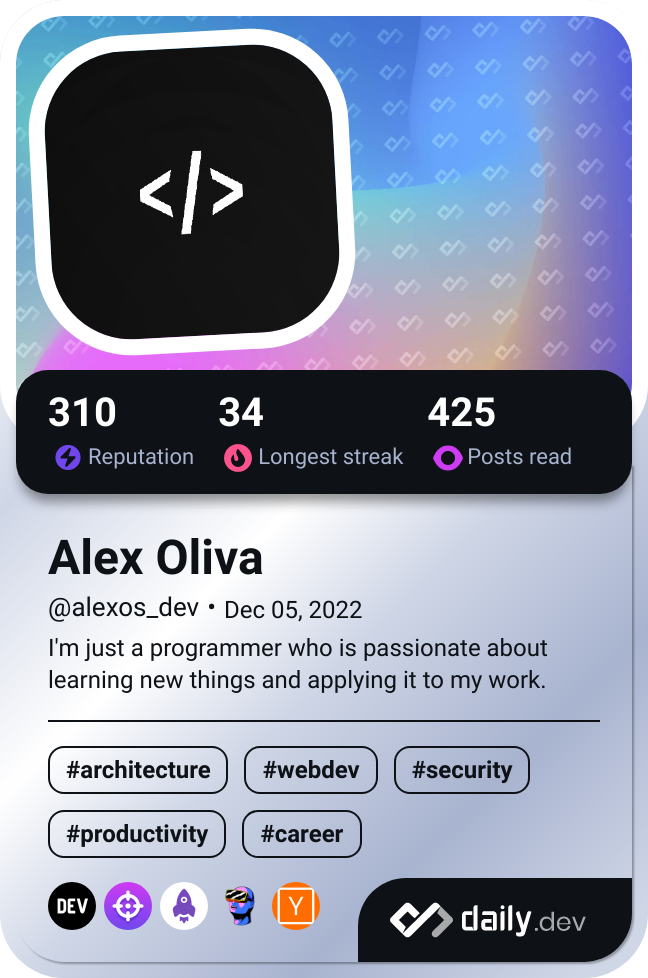

# 💫 Welcome! I'm Alex

<!-- 
 -->

<!-- 
 -->

I am a programmer specialized in JavaScript, Node, React and Next.js, and I am passionate about solving programming problems on platforms like LeetCode and CodeWars. I am always looking to improve my skills and learn new technologies to create innovative and efficient solutions.

<table align="left">
  <tr>
    <td>

- 🌱 I’m currently learning **OpenAI API and Next.js**

- 👯 I’m looking to collaborate on **OpenSource Projects**

- 👨‍💻 You can find my projects in my **[personal website](https://alexoliva.me)**

- 📫 How to reach me **alexoliva.developer@gmail.com**

- ⚡ Fun fact **I love to play the guitar 🎸 and I'm into competitive programming'.**
  </td>
  <td>
  

    </tr>
  </table>

## 🌐 Socials:

# 💻 Main Tech Stack:

## 🌐 Frontend

## ⚙️ Backend

## 🧪 Testing

## 🛠️ Tools

## 🚀 Deploy

# 📊 GitHub Stats:

 
 
 

---

## 💰 You can support me via:

